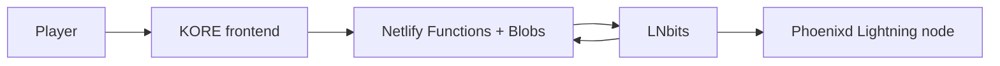

# LNbits + Phoenixd Paid Tournament Setup

This setup keeps paid tournament state in Netlify Blobs and uses LNbits only for exact Lightning invoices and prize payments. Players do not get balances, deposits, or withdrawals in the game.

## Architecture



## Server Setup

1. Provision a small VPS for Phoenixd and LNbits.
2. Install and run Phoenixd.
3. Install and run LNbits.
4. Connect LNbits to Phoenixd as the funding source.
5. Create a dedicated LNbits wallet for tournament entries and prizes.
6. Copy the wallet invoice key.
7. Copy the wallet admin key.
8. Generate a long random webhook secret.
9. Configure the Netlify site environment variables below.
10. Redeploy the Netlify site.

## Netlify Environment

```txt
TOURNAMENT_PAID_ENABLED=true
TOURNAMENT_LIGHTNING_PROVIDER=lnbits
TOURNAMENT_PUBLIC_BASE_URL=https://YOUR_GAME_SITE

LNBITS_URL=https://lnbits.yourdomain.com
LNBITS_INVOICE_KEY=...
LNBITS_ADMIN_KEY=...
LNBITS_WALLET_ID=...
LNBITS_WEBHOOK_SECRET=...

ENTRY_USD=2
PRIZE_1_USD=15
PRIZE_2_USD=10
PRIZE_3_USD=5
PAID_TOURNAMENT_MAX_PLAYERS=25
MAX_AUTO_PAYOUT_SATS=50000

VITE_TOURNAMENT_PAID_ENABLED=true
```

## LNbits Webhook

The game creates entry invoices with this webhook URL automatically:

```txt
https://YOUR_GAME_SITE/.netlify/functions/lnbits-webhook?token=LNBITS_WEBHOOK_SECRET
```

LNbits payment webhooks are token-protected here, and the function checks LNbits directly with:

```txt
GET /api/v1/payments/{checking_id}
```

Only a confirmed `paid: true` response counts the player as paid.

## Paid Tournament Rules In This Pass

- Entry is an exact `$2` Lightning invoice converted to sats at invoice creation time.
- Pending invoices do not count toward tournament start.
- Paid tournament starts at exactly 25 confirmed paid entries.
- Prize USD values are converted to sats once when the bracket locks.
- Prize places are recorded as:
  - 1st: `$15`
  - 2nd: `$10`
  - 3rd: `$5`
- Winners claim by submitting an exact-amount BOLT11 invoice from the tournament lobby.
- Automatic payout is blocked if the prize exceeds `MAX_AUTO_PAYOUT_SATS`.

## Smoke Test

1. Deploy with paid env vars enabled.
2. Open the game in production.
3. Go to `Tournament`.
4. Confirm `$2 Lightning` is enabled.
5. Select a character and enter the paid tournament.
6. Copy or open the Lightning invoice.
7. Pay it from a Lightning app.
8. Refresh the lobby.
9. Confirm the lobby changes from `Waiting for Lightning payment` to `Payment confirmed`.
10. Confirm the player count increments only after LNbits confirms the invoice.
